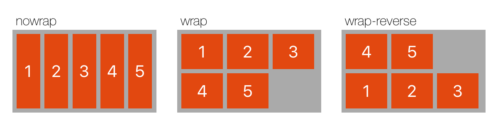
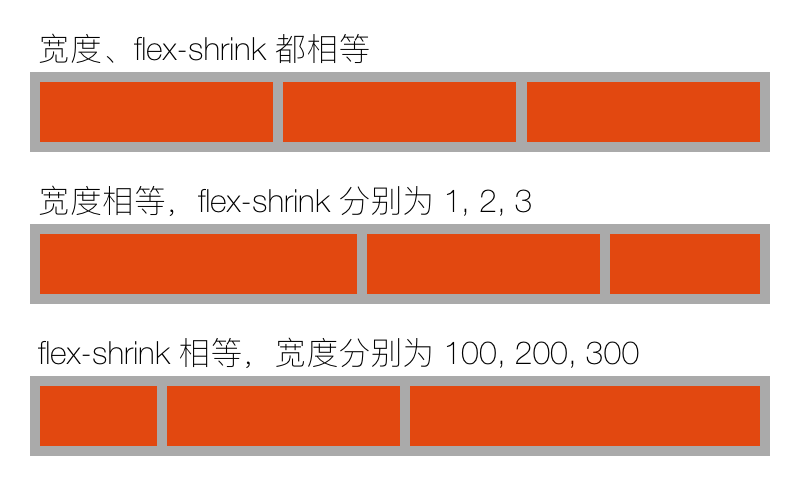
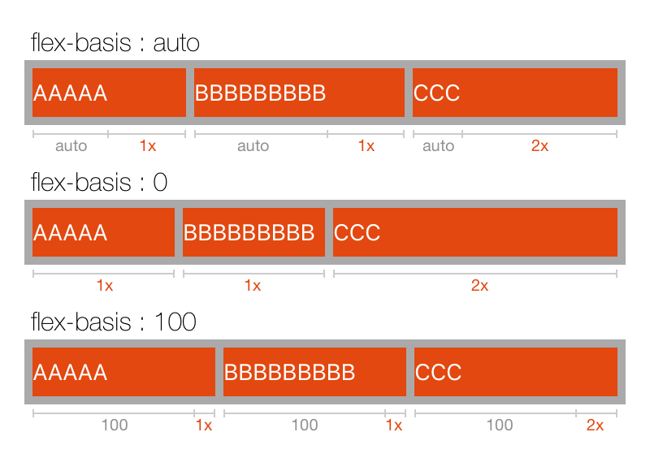
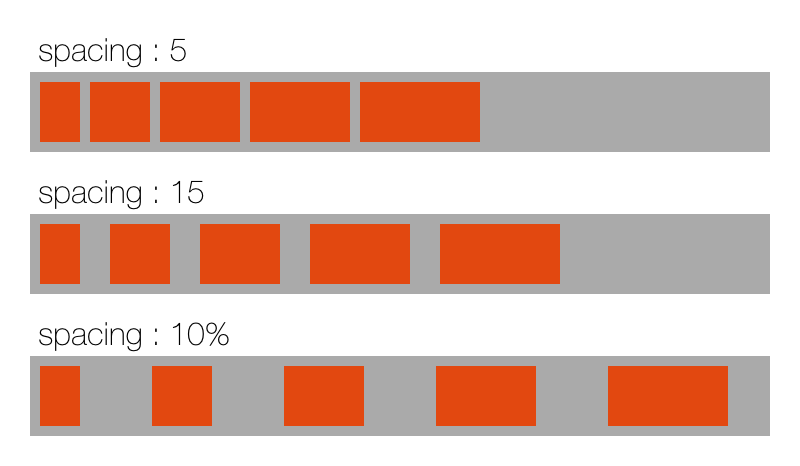
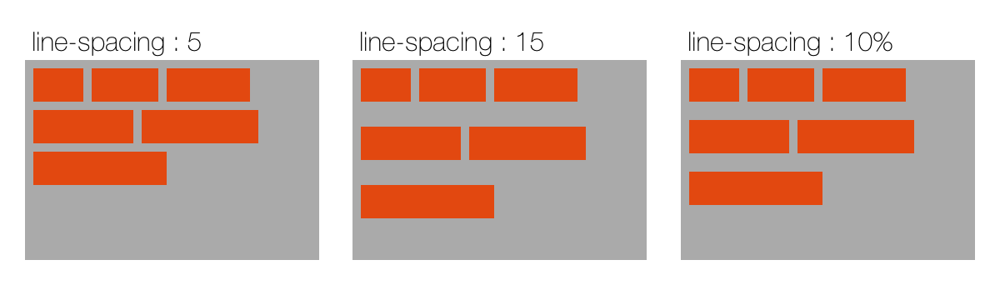
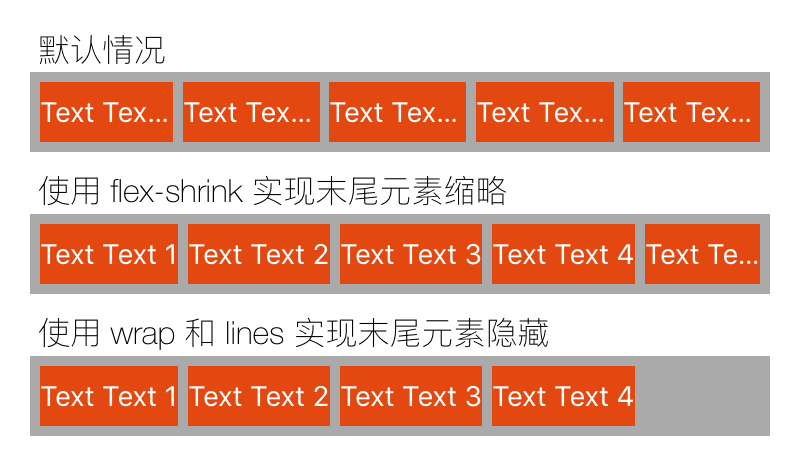

# 布局

Mist 使用的是基于 [`Flexbox`](#flexbox) 的布局模型，并进行了一些扩展，基本上满足大部分的布局需要。

## 基本属性

### width/height

指定元素的宽高，默认值为 `auto`。

- `auto`: 根据元素的内容或子元素的尺寸自动计算
- [*`length`*](#单位与百分比): 指定固定的尺寸

### min-width/min-height/max-width/max-height

元素的最小/最大尺寸。

- [*`length`*](#单位与百分比): 元素的最小/最大尺寸

### margin

元素的外边距，默认值为 `0`。

- `auto`: 所有为 `auto` 的 margin 均分剩余空间
- [*`length`*](#单位与百分比): 指定固定的尺寸

注意，当指定为百分比时，无论是左右边距还是上下边距，其百分比都是相对父容器的内容**宽度**（即减去 [`padding`](#padding)<!-- 和 border-->）。

`margin-top`、`margin-bottom`、`margin-left`、`margin-right` 分别设置上、下、左、右边距。  
`margin` 设置四个方向边距为同一个值。

### padding

元素的内边距，默认值为 `0`。

- [*`length`*](#单位与百分比): 指定固定的尺寸

注意，当指定为百分比时，无论是左右边距还是上下边距，其百分比都是相对父容器的内容**宽度**（即减去 `padding`<!-- 和 border-->）。  

`padding-top`、`padding-bottom`、`padding-left`、`padding-right` 分别设置上、下、左、右边距。  
`padding` 设置四个方向边距为同一个值。

**注意：对于*非容器元素*，padding 只会影响元素的尺寸，而不会影响其内容的绘制。**

## Flexbox

Flexbox 是 W3C 推出的一种新的布局方案，可以简便、完整、响应式地实现各种页面布局。

Mist 实现了基本的 Flexbox 布局算法，支持的 Flexbox 属性有 [flex-direction](#direction), [flex-wrap](#wrap), [align-items](#align-items), [justify-content](#justify-content), [align-content](#align-content), [align-self](#align-self), [flex-grow](#flex-grow), [flex-shrink](#flex-shrink), [flex-basis](#flex-basis)。

此外，Mist 增加了一些扩展属性：[spacing](#spacing), [line-spacing](#line-spacing), [fixed](#fixed), [lines](#lines), [items-per-line](#items-per-line)。

### direction

决定子元素的排列方向，默认为 `horizontal`。

- `horizontal`: 从左到右排列
- `vertical`: 从上到下排列
- `horizontal-reverse`: 从右到左排列
- `vertical-reverse`: 从下到上排列

{% set code =
{
  "layout": {
    "vars": {
      "direction": [
        "horizontal",
        "vertical",
        "horizontal-reverse",
        "vertical-reverse"
      ]
    },
    "style": {
      "spacing": 25,
      "padding": 15,
      "width": 600
    },
    "children": [
      {
        "repeat": "${direction.count}",
        "style": {
          "direction": "vertical",
          "flex-grow": 1,
          "flex-basis": 0,
          "spacing": 2
        },
        "children": [
          {
            "type": "text",
            "style": {
              "margin-left": 4,
              "font-size": 16,
              "font-name": "HelveticaNeue-Thin",
              "text": "${direction[_index_]}"
            }
          },
          {
            "style": {
              "background-color": "#aaa",
              "padding": 5,
              "spacing": 5,
              "height": 100,
              "flex-grow": 1,
              "direction": "${direction[_index_]}",
              "align-items": "stretch"
            },
            "children": [
              {
                "repeat": 3,
                "type": "text",
                "style": {
                  "flex-grow": 1,
                  "text": "${_index_ + 1}",
                  "font-size": 20,
                  "alignment": "center",
                  "background-color": "#E24810",
                  "color": "white"
                }
              }
            ]
          }
        ]
      }
    ]
  }
}
%}


### wrap

子元素是否允许换行。

- `nowrap`: 子元素超出容器时，所有子元素按照 flex-shrink 缩小。
- `wrap`: 子元素超出容器时将换行。
- `wrap-reverse`: 子元素超出容器时将换行，方向与 `wrap` 相反。

{% set code =
{
  "layout": {
    "vars": {
      "wrap": [
        "nowrap",
        "wrap",
        "wrap-reverse"
      ]
    },
    "style": {
      "spacing": 25,
      "padding": 15,
      "width": 600
    },
    "children": [
      {
        "repeat": "${wrap.count}",
        "style": {
          "direction": "vertical",
          "flex-grow": 1,
          "flex-basis": 0,
          "spacing": 2
        },
        "children": [
          {
            "type": "text",
            "style": {
              "margin-left": 4,
              "font-size": 16,
              "font-name": "HelveticaNeue-Thin",
              "text": "${wrap[_index_]}"
            }
          },
          {
            "style": {
              "background-color": "#aaa",
              "padding": 5,
              "spacing": 5,
              "line-spacing": 5,
              "height": 100,
              "flex-grow": 1,
              "wrap": "${wrap[_index_]}",
              "align-items": "stretch"
            },
            "children": [
              {
                "repeat": 5,
                "type": "text",
                "style": {
                  "width": 50,
                  "text": "${_index_ + 1}",
                  "font-size": 20,
                  "alignment": "center",
                  "background-color": "#E24810",
                  "color": "white"
                }
              }
            ]
          }
        ]
      }
    ]
  }
}
%}


### align-items

子元素在当前行的排列方向的垂直方向上的对齐方式。

> 每个子元素的 [`align-self`](#align-self) 属性可重写 `align-items` 属性。

- `start`: 元素位于容器的开头
- `center`: 元素位于容器的中心
- `end`: 元素位于容器的结尾
- `stretch`: 默认值。元素拉伸以填满容器
- `baseline`: 根据元素的基线位置对齐。文本的基线为第一行文字的基线，容器的基线为其第一个元素的基线。

</img>

{% set code =
{
  "layout": {
    "vars": {
      "alignItems": [
        "start",
        "center",
        "end",
        "stretch",
        "baseline"
      ]
    },
    "style": {
      "width": 600,
      "items-per-line": 3,
      "wrap": true,
      "spacing": 25,
      "line-spacing": 20,
      "padding": 15
    },
    "children": [
      {
        "repeat": "${alignItems.count}",
        "vars": {
          "isBaseline": "${_index_ == 4}"
        },
        "style": {
          "direction": "vertical",
          "flex-basis": "${isBaseline ? 25 : 0}",
          "flex-grow": "${isBaseline ? 2 : 1}",
          "spacing": 2
        },
        "children": [
          {
            "type": "text",
            "style": {
              "margin-left": 4,
              "font-size": 16,
              "font-name": "HelveticaNeue-Thin",
              "text": "${alignItems[_index_]}"
            }
          },
          {
            "vars": {
              "items": [50, 80, 60, 70]
            },
            "style": {
              "background-color": "#aaa",
              "padding": 5,
              "spacing": 5,
              "line-spacing": 5,
              "height": 100,
              "flex-grow": 1,
              "align-items": "${alignItems[_index_]}"
            },
            "children": [
              {
                "repeat": "${items}",
                "type": "text",
                "style": {
                  "text": "${isBaseline ? 'test text' : ''}",
                  "flex-grow": 1,
                  "height": "${isBaseline ? 'auto' : _item_}",
                  "padding-top": 10,
                  "padding-bottom": "${isBaseline ? _item_ * 0.5 : 0}",
                  "font-size": "${isBaseline ? _item_ * 0.3 : 0}",
                  "alignment": "center",
                  "background-color": "#E24810",
                  "color": "white"
                }
              }
            ]
          }
        ]
      }
    ]
  }
}
%}


 

<!--sec data-title="示例" data-id="section0" data-collapse=true ces-->

Name

Age

Home town

Mark Zuckerberg

32

New York, U.S.

{% set code =
{
  "padding": 15,
  "background-color": "#eee",
  "spacing": 10,
  "children": [
    {
      "direction": "vertical",
      "align-items": "end",
      "spacing": 3,
      "children": [
        {
          "type": "text",
          "text": "Name",
          "background-color": "red",
          "color": "white",
          "corner-radius": 2,
          "padding-left": 3,
          "padding-right": 3
        },
        {
          "type": "text",
          "text": "Age",
          "background-color": "red",
          "color": "white",
          "corner-radius": 2,
          "padding-left": 3,
          "padding-right": 3
        },
        {
          "type": "text",
          "text": "Home town",
          "background-color": "red",
          "color": "white",
          "corner-radius": 2,
          "padding-left": 3,
          "padding-right": 3
        }
      ]
    },
    {
      "direction": "vertical",
      "align-items": "start",
      "spacing": 3,
      "children": [
        {
          "type": "text",
          "text": "Mark Zuckerberg",
          "color": "#888"
        },
        {
          "type": "text",
          "text": "32",
          "color": "#888"
        },
        {
          "type": "text",
          "text": "New York, U.S.",
          "color": "#888"
        }
      ]
    }
  ]
}
%}


<!--endsec-->

### justify-content

子元素在布局方向上的对齐方式。

- `start`: 默认值。元素位于容器的开头
- `end`: 元素位于容器的结尾
- `center`: 元素位于容器的中心
- `space-between`: 所有子元素均匀分布在行内，空白平均分布在每两个元素中间，首尾元素对齐到容器两端
- `space-around`: 所有子元素均匀分布在行内，空白平均分布在所有元素两侧

</img>

{% set code =
{
  "layout": {
    "vars": {
      "justifyContent": [
        "start",
        "center",
        "end",
        "space-between",
        "space-around"
      ]
    },
    "style": {
      "direction": "vertical",
      "width": 400,
      "spacing": 15,
      "padding": 15
    },
    "children": [
      {
        "repeat": "${justifyContent.count}",
        "style": {
          "direction": "vertical",
          "spacing": 2
        },
        "children": [
          {
            "type": "text",
            "style": {
              "margin-left": 4,
              "font-size": 16,
              "font-name": "HelveticaNeue-Thin",
              "text": "${justifyContent[_index_]}"
            }
          },
          {
            "vars": {
              "items": [50, 30, 70, 20]
            },
            "style": {
              "background-color": "#aaa",
              "padding": 5,
              "spacing": 5,
              "line-spacing": 5,
              "flex-grow": 1,
              "justify-content": "${justifyContent[_index_]}"
            },
            "children": [
              {
                "repeat": "${items}",
                "style": {
                  "width": "${_item_}",
                  "height": 30,
                  "background-color": "#E24810"
                }
              }
            ]
          }
        ]
      }
    ]
  }
}
%}


### align-content

容器内各行的对齐方式

- `start`: 行位于容器的开头
- `end`: 行位于容器的结尾
- `center`: 行位于容器的中心
- `stretch`: 默认值。行拉伸以填满容器
- `space-between`: 所有行均匀分布在容器内，空白平均分布在每两行中间，首尾行对齐到容器两端
- `space-around`: 所有行均匀分布在容器内，空白平均分布在所有行两侧

</img>

{% set code =
{
  "layout": {
    "vars": {
      "alignContent": [
        "start",
        "center",
        "end",
        "stretch",
        "space-between",
        "space-around"
      ]
    },
    "style": {
      "width": 600,
      "items-per-line": 3,
      "wrap": true,
      "spacing": 25,
      "line-spacing": 20,
      "padding": 15
    },
    "children": [
      {
        "repeat": "${alignContent.count}",
        "style": {
          "direction": "vertical",
          "flex-basis": 0,
          "flex-grow": 1,
          "spacing": 2
        },
        "children": [
          {
            "type": "text",
            "style": {
              "margin-left": 4,
              "font-size": 16,
              "font-name": "HelveticaNeue-Thin",
              "text": "${alignContent[_index_]}"
            }
          },
          {
            "vars": {
              "items": [50, 30, 70, 20, 40, 60, 40, 50]
            },
            "style": {
              "height": 110,
              "wrap": true,
              "background-color": "#aaa",
              "padding": 5,
              "spacing": 5,
              "line-spacing": 5,
              "align-content": "${alignContent[_index_]}"
            },
            "children": [
              {
                "repeat": "${items}",
                "style": {
                  "width": "${_item_}",
                  "min-height": 20,
                  "background-color": "#E24810"
                }
              }
            ]
          }
        ]
      }
    ]
  }
}
%}


### align-self

覆写父元素的 [`align-items`](#align-items)，指定元素在父元素中（沿父元素布局方向）的对齐方式，取值同 `align-items`。

### flex-grow

元素放大的权值，默认值为 `0`（即元素不会被放大）。不能为负数。

当容器的空间（在布局方向上）有剩余时，所有子元素（在布局方向上）的尺寸会放大以填满剩余空间，`flex-grow` 决定元素放大的权值。见 [`flex-basis`](#flex-basis)。

当所有子元素的 `flex-grow` 总和小于 1 时，总权值按 1 计算，即剩余空间不会被填满，如下图第 3 行。

{% set code =
{
  "layout": {
    "vars": {
      "flexGrow": [
        [1, 1, 1],
        [3, 2, 1],
        [0.1, 0.2, 0.2]
      ]
    },
    "style": {
      "direction": "vertical",
      "width": 400,
      "spacing": 15,
      "padding": 15
    },
    "children": [
      {
        "repeat": "${flexGrow}",
        "style": {
          "direction": "vertical",
          "spacing": 2
        },
        "children": [
          {
            "type": "text",
            "style": {
              "margin-left": 4,
              "font-size": 16,
              "font-name": "HelveticaNeue-Thin",
              "text": "flex-grow 分别为 ${_item_.join(', ')}"
            }
          },
          {
            "style": {
              "background-color": "#aaa",
              "padding": 5,
              "spacing": 5,
              "line-spacing": 5,
              "flex-grow": 1
            },
            "children": [
              {
                "repeat": "${_item_}",
                "style": {
                  "flex-grow": "${_item_}",
                  "height": 30,
                  "background-color": "#E24810"
                }
              }
            ]
          }
        ]
      }
    ]
  }
}
%}


### flex-shrink

元素缩小的权值，默认值为 `1`。不能为负数。

当容器的空间不足以放下所有子元素时，所有子元素的大小会缩小以填满剩余空间。  
元素的 [flex-basis](#flex-basis) 也会计入权值，即实际权值为 `flex-shrink` * [`flex-basis`](#flex-basis) 。

默认值为 `1`，也就是说，当空间不足时，所有元素等比缩小。

像图标、头像之类的元素，一般是不允许缩小的，这时记得将 `flex-shrink` 设置为 `0` 。

{% set code =
{
  "layout": {
    "vars": {
      "items": [
        {
          "desc": "宽度、flex-shrink 都相等",
          "width": [200, 200, 200],
          "flexShrink": [1, 1, 1]
        },
        {
          "desc": "宽度相等，flex-shrink 分别为 1, 2, 3",
          "width": [200, 200, 200],
          "flexShrink": [1, 2, 3]
        },
        {
          "desc": "flex-shrink 相等，宽度分别为 100, 200, 300",
          "width": [100, 200, 300],
          "flexShrink": [1, 1, 1]
        }
      ]
    },
    "style": {
      "direction": "vertical",
      "width": 400,
      "spacing": 15,
      "padding": 15
    },
    "children": [
      {
        "repeat": "${items}",
        "vars": {
          "item": "${_item_}"
        },
        "style": {
          "direction": "vertical",
          "spacing": 2
        },
        "children": [
          {
            "type": "text",
            "style": {
              "margin-left": 4,
              "font-size": 16,
              "font-name": "HelveticaNeue-Thin",
              "text": "${_item_.desc}"
            }
          },
          {
            "style": {
              "background-color": "#aaa",
              "padding": 5,
              "spacing": 5,
              "line-spacing": 5,
              "flex-grow": 1
            },
            "children": [
              {
                "repeat": "${item.width.count}",
                "style": {
                  "width": "${item.width[_index_]}",
                  "flex-shrink": "${item.flexShrink[_index_]}",
                  "height": 30,
                  "background-color": "#E24810"
                }
              }
            ]
          }
        ]
      }
    ]
  }
}
%}


### flex-basis

元素伸缩时的基准尺寸。容器计算剩余空间时，使用子元素的基准尺寸来计算已分配空间。默认值为 `auto`。

- `auto`: 取 [width/height](#width/height) 的值（取决于父容器的布局方向）
- `content`: 取元素的内容尺寸
- [*`length`*](#单位与百分比): 设置固定的尺寸或百分比

如下图，3个子元素的 [flex-grow](#flex-grow) 分别为 1, 1, 2 ，先根据每个元素的 flex-basis 计算各自的基本尺寸，再将剩余空间按权值分配给每个元素。

</img>

{% set code =
{
  "layout": {
    "vars": {
      "flexBasis": ["auto", 0, 100]
    },
    "style": {
      "direction": "vertical",
      "width": 400,
      "spacing": 25,
      "padding": 15
    },
    "children": [
      {
        "repeat": "${flexBasis}",
        "vars": {
          "value": "${_item_}"
        },
        "style": {
          "direction": "vertical",
          "spacing": 2
        },
        "children": [
          {
            "type": "text",
            "style": {
              "margin-left": 4,
              "font-size": 16,
              "font-name": "HelveticaNeue-Thin",
              "text": "flex-basis : ${_item_}"
            }
          },
          {
            "style": {
              "background-color": "#aaa",
              "padding": 5,
              "spacing": 5,
              "line-spacing": 5,
              "flex-grow": 1
            },
            "children": [
              {
                "repeat": "${['AAAAA', 'BBBBBBBBB', 'CCC']}",
                "type": "text",
                "style": {
                  "text": "${_item_}",
                  "flex-basis": "${value}",
                  "color": "white",
                  "flex-grow": "${_index_ == 2 ? 2 : 1}",
                  "height": 30,
                  "background-color": "#E24810"
                }
              }
            ]
          }
        ]
      }
    ]
  }
}
%}


## 扩展属性

### spacing

子元素间的间距。

为每两个子元素之间添加间距，每行的第一个元素之前和最后一个元素之后不会添加。

{% set code =
{
  "layout": {
    "vars": {
      "spacing": [5, 15, "10%"]
    },
    "style": {
      "direction": "vertical",
      "width": 400,
      "spacing": 10,
      "padding": 15
    },
    "children": [
      {
        "repeat": "${spacing}",
        "vars": {
          "value": "${_item_}"
        },
        "style": {
          "direction": "vertical",
          "spacing": 2
        },
        "children": [
          {
            "type": "text",
            "style": {
              "margin-left": 4,
              "font-size": 16,
              "font-name": "HelveticaNeue-Thin",
              "text": "spacing : ${_item_}"
            }
          },
          {
            "style": {
              "background-color": "#aaa",
              "padding": 5,
              "spacing": "${_item_}",
              "flex-grow": 1
            },
            "children": [
              {
                "repeat": "${[20, 30, 40, 50, 60]}",
                "style": {
                  "width": "${_item_}",
                  "height": 30,
                  "background-color": "#E24810"
                }
              }
            ]
          }
        ]
      }
    ]
  }
}
%}


### line-spacing

多行布局的行间距。

为每两行之间添加间距，跟 [`spacing`](#spacing) 相似。

{% set code =
{
  "layout": {
    "vars": {
      "lineSpacing": [5, 15, "10%"]
    },
    "style": {
      "width": 600,
      "spacing": 20,
      "padding": 15
    },
    "children": [
      {
        "repeat": "${lineSpacing}",
        "vars": {
          "value": "${_item_}"
        },
        "style": {
          "direction": "vertical",
          "spacing": 2
        },
        "children": [
          {
            "type": "text",
            "style": {
              "margin-left": 4,
              "font-size": 16,
              "font-name": "HelveticaNeue-Thin",
              "text": "line-spacing : ${_item_}"
            }
          },
          {
            "style": {
              "height": 120,
              "wrap": true,
              "align-content": "start",
              "background-color": "#aaa",
              "padding": 5,
              "spacing": 5,
              "line-spacing": "${_item_}",
              "flex-grow": 1
            },
            "children": [
              {
                "repeat": "${[30, 40, 50, 60, 70, 80]}",
                "style": {
                  "width": "${_item_}",
                  "height": 20,
                  "background-color": "#E24810"
                }
              }
            ]
          }
        ]
      }
    ]
  }
}
%}


### fixed

是否为固定布局元素，固定元素不参与弹性布局，也不会对父容器的布局有任何影响，而是直接相对于父元素布局（等其它弹性元素布局完成之后再布局）。fixed 元素通过 width, height, margin 属性来确定元素的位置与大小。

适合用于浮层、角标等元素。默认情况下（不设置 width, height, margin），一个 fixed 元素就是和父容器等大的一个浮层，也可以放置于容器底部作为背景。

fixed 元素并不是一定处于其它元素的最上方，而是同其它元素一样，按照其在父容器里的顺序排列。

{% set code =
{
  "layout": {
    "vars": {
      "items": [
        {
          "margin": 5
        },
        {
          "margin": "auto"
        },
        {
          "margin-left": "50%"
        },
        {
          "margin-top": "auto",
          "margin-bottom": "auto",
          "height": "50%"
        },
        {
          "margin": "auto",
          "margin-top": 0,
          "width": "50%"
        },
        {
          "margin-left": "auto",
          "margin-bottom": "auto",
          "margin-top": 5,
          "margin-right": 5
        }
      ]
    },
    "style": {
      "wrap": true,
      "items-per-line": 3,
      "width": 600,
      "spacing": 25,
      "line-spacing": 10,
      "padding": 15
    },
    "children": [
      {
        "repeat": "${items}",
        "vars": {
          "value": "${_item_}"
        },
        "style": {
          "flex-grow": 1,
          "flex-basis": 0,
          "direction": "vertical"
        },
        "children": [
          {
            "style": {
              "height": 100,
              "background-color": "#aaa"
            },
            "children": [
              {
                "type": "text",
                "style": {
                  "fixed": true,
                  "text": "Text",
                  "alignment": "center",
                  "color": "white",
                  "padding": 3,
                  "width": "${_item_.width}",
                  "height": "${_item_.height}",
                  "margin": "${_item_.margin}",
                  "margin-top": "${_item_['margin-top']}",
                  "margin-left": "${_item_['margin-left']}",
                  "margin-bottom": "${_item_['margin-bottom']}",
                  "margin-right": "${_item_['margin-right']}",
                  "background-color": "#E24810"
                }
              }
            ]
          },
          {
            "type": "text",
            "style": {
              "margin-left": 4,
              "font-size": 16,
              "font-name": "HelveticaNeue-Thin",
              "lines": 0,
              "text": "${_item_.allKeys.select(k -> k + ' : ' + _item_[k]).join('\\n')}"
            }
          }
        ]
      }
    ]
  }
}
%}


<!--sec data-title="示例" data-id="section1" data-collapse=true ces-->

标题标题标题

副标题副标题副标题副标题

{% set code =
{
  "height": 200,
  "direction": "vertical",
  "align-items": "center",
  "justify-content": "center",
  "spacing": 10,
  "children": [
    {
      "fixed": true,
      "type": "image",
      "image-url": "https://zos.alipayobjects.com/rmsportal/bWgozvMAmwVrKLS.png"
    },
    {
      "fixed": true,
      "background-color": "#4000"
    },
    {
      "type": "text",
      "text": "标题标题标题",
      "color": "white",
      "font-style": "bold",
      "font-size": 18
    },
    {
      "type": "text",
      "text": "副标题副标题副标题副标题",
      "color": "white",
      "font-size": 15
    },
    {
      "fixed": true,
      "type": "image",
      "image-url": "https://zos.alipayobjects.com/rmsportal/biYSeGKxXJxercU.png",
      "width": 40,
      "height": 40,
      "margin-left": "auto",
      "margin-bottom": "auto"
    }
  ]
}
%}


<!--endsec-->

### lines

仅对多行容器有效（即 [`wrap`](#wrap) 不为 `nowrap`），限制最大行数。默认为 `0`，即不限制行数。

可以用来隐藏放不下的元素，如下图第 3 行

{% set code =
{
  "layout": {
    "style": {
      "direction": "vertical",
      "width": 400,
      "spacing": 10,
      "padding": 15
    },
    "children": [
      {
        "style": {
          "direction": "vertical",
          "spacing": 2
        },
        "children": [
          {
            "type": "text",
            "style": {
              "margin-left": 4,
              "font-size": 16,
              "font-name": "HelveticaNeue-Thin",
              "text": "默认情况"
            }
          },
          {
            "style": {
              "background-color": "#aaa",
              "padding": 5,
              "spacing": 5
            },
            "children": [
              {
                "repeat": 5,
                "type": "text",
                "style": {
                  "text": "Text Text ${_index_ + 1}",
                  "color": "white",
                  "height": 30,
                  "background-color": "#E24810"
                }
              }
            ]
          }
        ]
      },
      {
        "style": {
          "direction": "vertical",
          "spacing": 2
        },
        "children": [
          {
            "type": "text",
            "style": {
              "margin-left": 4,
              "font-size": 16,
              "font-name": "HelveticaNeue-Thin",
              "text": "使用 flex-shrink 实现末尾元素缩略"
            }
          },
          {
            "style": {
              "background-color": "#aaa",
              "padding": 5,
              "spacing": 5
            },
            "children": [
              {
                "repeat": 5,
                "type": "text",
                "style": {
                  "text": "Text Text ${_index_ + 1}",
                  "flex-shrink": "${pow(1000, _index_)}",
                  "color": "white",
                  "height": 30,
                  "background-color": "#E24810"
                }
              }
            ]
          }
        ]
      },
      {
        "style": {
          "direction": "vertical",
          "spacing": 2
        },
        "children": [
          {
            "type": "text",
            "style": {
              "margin-left": 4,
              "font-size": 16,
              "font-name": "HelveticaNeue-Thin",
              "text": "使用 wrap 和 lines 实现末尾元素隐藏"
            }
          },
          {
            "style": {
              "background-color": "#aaa",
              "padding": 5,
              "spacing": 5,
              "wrap": "wrap",
              "lines": 1
            },
            "children": [
              {
                "repeat": 5,
                "type": "text",
                "style": {
                  "text": "Text Text ${_index_ + 1}",
                  "color": "white",
                  "height": 30,
                  "background-color": "#E24810"
                }
              }
            ]
          }
        ]
      }
    ]
  }
}
%}


### items-per-line

仅对多行容器有效（即 [`wrap`](#wrap) 不为 `nowrap`），限制每行最大元素个数。默认为 `0`，即不限制。

## 单位与百分比

元素的尺寸、边距等属性可以直接指定为一个数字，如 `"width": 100`，也可以使用百分比和单位，如 `"50%"`, `"1px"`, `"100vw"`。

### 百分比

百分比表示其最终值是相对于父容器的宽度或高度（减去padding），以下属性支持使用百分比指定：

- [`width`](#widthheight) 相对于父容器的宽度。
- [`height`](#widthheight) 相对于父容器的高度。
- [`min-width`等](#min-widthmin-heightmax-widthmax-height) 同 `width`/`height`。
- [`flex-basis`](#flex-basis) 相对于父容器在布局方向上的尺寸。
- [`margin`](#margin)、[`padding`](#padding) 相对于父容器的宽度。
- [`spacing`](#spacing) 相对于父容器在布局方向上的尺寸。
- [`line-spacing`](#line-spacing) 相对于父容器在布局方向的垂直方向上的尺寸。

### 单位

不带单位时使用系统原生的单位。支持以下单位：

`px` 物理像素，一般用于一像素的分割线或边框。注意与 css 中的 `px` 不同。  
`mm`、`cm`、`vw` 等单位详见 `FlexLayout.h` 文件定义。
