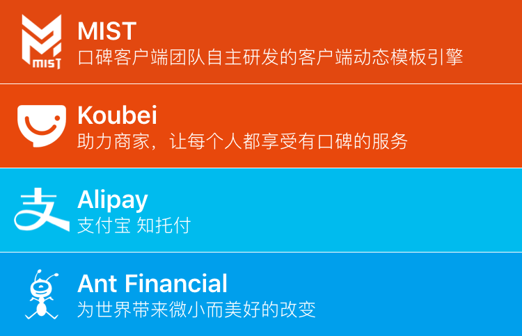

# 快速上手

## Hello World

Mist 使用 Json 来描述模版，下面是 Mist 的 Hello World：




第 2 行 `layout` 指定模版的布局，`layout` 里有一个 `text` 元素，`style` 里指定元素的样式属性。

## 样式

为元素设置样式属性以实现丰富多彩的界面，完整样式属性见[这里](Style.md)。




## 数据绑定

数据：




模版：




模版中使用 `${}` 嵌入表达式，进行数据绑定和一些简单的逻辑处理。

Mist 表达式支持基本的数学运算、逻辑运算等，并可以动态调用部分 native 方法，详见[这里](DataBinding.md)。

## 布局

Mist 使用基于 Flexbox 的布局模型，使用简单功能强大，熟悉以后写界面 so easy~

{% set code =
{
  "layout": {
    "style": {
      "height": 60,
      "background-color": "#E24810",
      "padding": 10,
      "spacing": 5
    },
    "children": [
      {
        "type": "image",
        "style": {
          "width": 40,
          "height": 40,
          "image-url": "https://gw.alipayobjects.com/zos/rmsportal/oJGxiJoNVldUwQpaZUrH.png",
          "content-mode": "scale-aspect-fit"
        }
      },
      {
        "style": {
          "direction": "vertical",
          "justify-content": "center"
        },
        "children": [
          {
            "type": "text",
            "style": {
              "text": "MIST",
              "color": "white",
              "font-size": 18,
              "font-style": "bold"
            }
          },
          {
            "type": "text",
            "style": {
              "text": "口碑客户端团队自主研发的客户端动态模板引擎",
              "color": "white",
              "font-size": 13,
              "font-style": "thin",
              "alignment": "center"
            }
          }
        ]
      }
    ]
  }
}
%}


## 元素重复

在需要根据数据生成重复的元素时，可以使用 [`repeat`](Property.md#repeat) 属性

数据：

{% set code =
{
  "list": [
    {
      "name": "MIST",
      "icon": "https://gw.alipayobjects.com/zos/rmsportal/oJGxiJoNVldUwQpaZUrH.png",
      "desc": "口碑客户端团队自主研发的客户端动态模板引擎",
      "color": "#E24810"
    },
    {
      "name": "Koubei",
      "icon": "https://gw.alipayobjects.com/zos/rmsportal/dhIEUxgCigfBzZnHPfqY.png",
      "desc": "助力商家，让每个人都享受有口碑的服务",
      "color": "#E8480C"
    },
    {
      "name": "Alipay",
      "icon": "https://gw.alipayobjects.com/zos/rmsportal/msQPPTFLPEHeErXEfdse.png",
      "desc": "支付宝 知托付",
      "color": "#00BBEE"
    },
    {
      "name": "Ant Financial",
      "icon": "https://gw.alipayobjects.com/zos/rmsportal/DeSYPOWNsMLMISVDqZol.png",
      "desc": "为世界带来微小而美好的改变",
      "color": "#009FEC"
    }
  ]
}
%}


模版：

{% set code =
{
  "layout": {
    "style": {
      "direction": "vertical",
      "spacing": "1px"
    },
    "children": [
      {
        "repeat": "${list}",
        "style": {
          "height": 60,
          "background-color": "${_item_.color}",
          "padding": 10,
          "spacing": 5
        },
        "children": [
          {
            "type": "image",
            "style": {
              "width": 40,
              "height": 40,
              "image-url": "${_item_.icon}",
              "content-mode": "scale-aspect-fit"
            }
          },
          {
            "style": {
              "direction": "vertical",
              "justify-content": "center"
            },
            "children": [
              {
                "type": "text",
                "style": {
                  "text": "${_item_.name}",
                  "color": "white",
                  "font-size": 18,
                  "font-style": "bold"
                }
              },
              {
                "type": "text",
                "style": {
                  "text": "${_item_.desc}",
                  "color": "white",
                  "font-size": 13,
                  "font-style": "thin",
                  "alignment": "center"
                }
              }
            ]
          }
        ]
      }
    ]
  }
}
%}


## 状态

可以通过更新状态来实现界面的更新

<video class="demo" width="375px" autoplay loop>
  <source src="tutorial_5.mp4" type="video/mp4">
Your browser does not support the video tag.
</video>

数据同上

模版：

{% set code =
{
  "layout": {
    "style": {
      "direction": "vertical",
      "spacing": "1px"
    },
    "children": [
      {
        "repeat": "${list}",
        "style": {
          "height": 60,
          "background-color": "${_item_.color}",
          "padding": 10,
          "spacing": 5
        },
        "children": [
          {
            "type": "image",
            "style": {
              "width": 40,
              "height": 40,
              "image-url": "${_item_.icon}",
              "content-mode": "scale-aspect-fit"
            }
          },
          {
            "style": {
              "direction": "vertical",
              "justify-content": "center"
            },
            "children": [
              {
                "type": "text",
                "style": {
                  "text": "${_item_.name}",
                  "color": "white",
                  "font-size": 18,
                  "font-style": "bold"
                }
              },
              {
                "type": "text",
                "style": {
                  "text": "${_item_.desc}",
                  "color": "white",
                  "font-size": 13,
                  "font-style": "thin",
                  "alignment": "center"
                }
              }
            ]
          }
        ]
      },
      {
        "gone": "${state.expanded}",
        "type": "button",
        "style": {
          "title": "显示全部",
          "title-color": "#888",
          "background-image": {
            "highlighted": "#ccc"
          },
          "padding": 10
        },
        "on-tap": {
          "updateState:": {
            "expanded": true
          }
        }
      }
    ]
  }
}
%}


在 `显示全部` 按钮的 `on-tap` 事件中调用 `updateState:` 触发了状态更新，`expanded` 被设置为 true，整个界面重新生成
