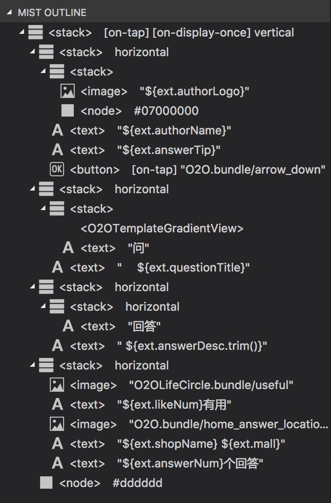

# VSCode 插件

> Visual Studio Code (简称 VS Code / VSC) 是一款免费开源的现代化轻量级代码编辑器，支持几乎所有主流的开发语言的语法高亮、智能代码补全、自定义热键、括号匹配、代码片段、代码对比 Diff、GIT 等特性，支持插件扩展，并针对网页开发和云端应用开发做了优化。软件跨平台支持 Win、Mac 以及 Linux，功能强大，运行流畅。[下载地址](https://code.visualstudio.com/)

Mist 的 Visual Studio Code 插件提供属性提示、Node树预览等功能，提高开发效率。

## 安装

直接在 VSCode 的扩展商店搜索 `MIST` 即可安装

## 更新

VSCode 默认会自动更新插件

## 使用

大部分功能需要编辑器语言设置为 `MIST` 才能使用，如果是 `.mist` 文件，会自动设置为 `MIST` 语言。

## 代码高亮

对模版中表达式进行语法高亮

## 代码提示

编写 Mist 模版时会根据上下文提示当前可用属性，鼠标移到属性名或枚举值上可以显示属性描述。

<video width="770px" controls style="border-radius:4px" autoplay loop>
  <source src="https://gw.alipayobjects.com/os/rmsportal/scfbArcHAZkpWhRSwIff.mp4" type="video/mp4">
Your browser does not support the video tag.
</video>

## 模版布局结构

在编辑 Mist 模版文件时，左侧的资源管理器里的 `MIST OUTLINE` 会显示模版的布局结构，点击节点可高亮对应代码位置。

